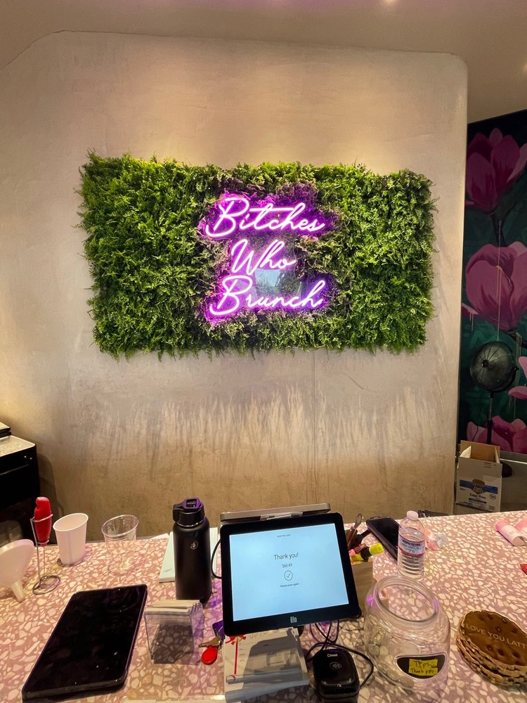
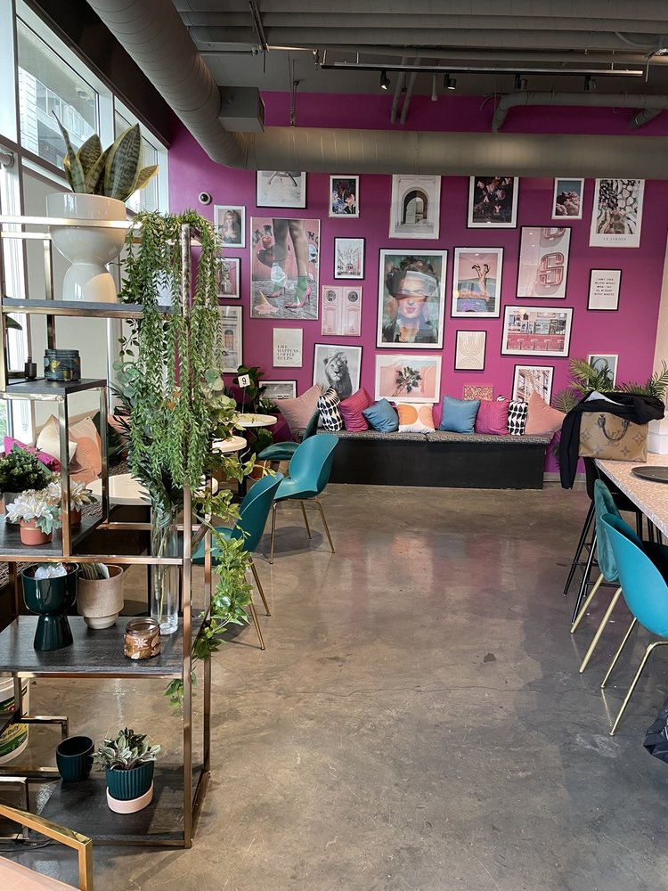
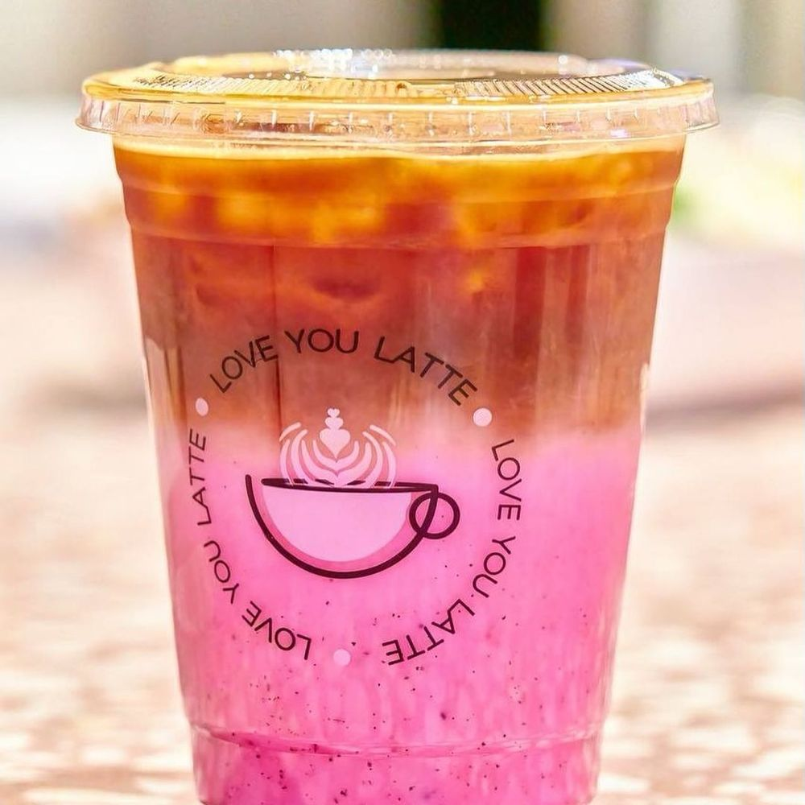

# loveyoulatte
Redesign website of my favorite coffee shop. 

The task is to (1) develop a single-page website for your favorite small business in LA and (2) deploy it online. Please make sure to include a note on your website that it is an unofficial webpage for the small business; if this small business already has a website, please submit your own personal redesign or reimagination of that website instead of duplicating the existing one.

Time spent: **15** hours spent in total

## Inspiration
I was given an invitation to start this project on Wednesday, April 19th. At first, I was lost because I had no idea on what to create. However, by that Saturday (April 22), I had been struck with inspiration: I decided to design a website that was inspired by LoveYouLatte.

My first experience at the LoveYouLatte coffee shop, located in Glendale, left a lasting impression on me. Having visited countless coffee shops in the past, I was surprised at how unique LoveYouLatte's decor and atmosphere was. The coffee shop's colors and layout gave off a Wes Anderson-esque aesthetic, which immediately caught my attention. Upon entering the coffee shop, a bright purple light that read "bitches who brunch" greeted me, adding to the playful yet welcoming vibe of the place. A pink wall adorned with a series of paintings was located to the left of the shop, but what caught my eye was a beautiful piece featuring the artwork of Frida Kahlo. It felt as though I had stumbled upon a place that truly resonated with my experience.

I was inspired to create my own project because of the way that LoveYouLatte made me feel. The welcoming and warm atmosphere made me want to create a similar experience for others, and the unique aesthetic provided me with inspiration for my own project.

**Preview**
<table>
<tr>
<td width="25%">
<center>beam</center>
</td>
<td width="25%">
<center>Art!</center>
</td>
<td width="25%">
<center>Vibes</center>
</td>
<td width="25%">
<center>My Order</center>
</td>
</tr>
<tr>
<td width="25%">
</img>
</td>
<td width="25%">
</img>
</td>
<td width="25%">
</img>
</td>
<td width="25%">
</img>
</td>
</tr>
</table>

## My order: 
- Burrito de Chorizo (10/10)
- Vanilla Latte (10/10)


## Deployed project
access: http://loveyoulatte.duckdns.org:5000

## User Stories

The following **required** functionality is completed:

- [x] A section for “About the Business”
- [x] A section with images and descriptions of three (3) to four (4) items/services offered by the business
- [x] At least one HTML button linking to a different website
- [x] A CSS file for styling your website. Use this file to change the color palette and fonts for your website; they cannot be the same as the ones from a template if you choose to use one.
- [x] publish website 

The following **bonus** features are implemented:
- [ ] A photo gallery
- [x] Navigation menu and multiple pages
- [ ] An “overview” section linking to other sections with page anchors
- [x] onHover/onScroll animations
- [x] A mobile responsive site
- [x] More advanced use of flexbox/grid CSS
- [ ] Display if the business is currently open or closed
- [ ] Hide a part of the page until a button is clicked
- [ ] Add something with a JS library you haven’t used before
- [x] dark mode


## TOOLS 
- Tmux 
- CentOS for deployment 
- flask 
- python
- linux 
- Javascript
- html/css

## Installation

Make sure you have python3 and pip installed

Create and activate virtual environment using virtualenv
```bash
$ python -m venv python3-virtualenv
$ source python3-virtualenv/bin/activate
```

Use the package manager [pip](https://pip.pypa.io/en/stable/) to install all dependencies!

```bash
pip install -r requirements.txt
```

## Usage

Create a .env file using the example.env template (make a copy using the variables inside of the template)

Start flask development server
```bash
$ export FLASK_ENV=development
$ flask run
```

You should get a response like this in the terminal:
```
❯ flask run
 * Environment: development
 * Debug mode: on
 * Running on http://127.0.0.1:5000/ (Press CTRL+C to quit)
```

You'll now be able to access the website at `localhost:5000` or `127.0.0.1:5000` in the browser! 

## References 
- https://github.com/MLH-Fellowship/sre-portfolio-site (used just the flask starter code)


