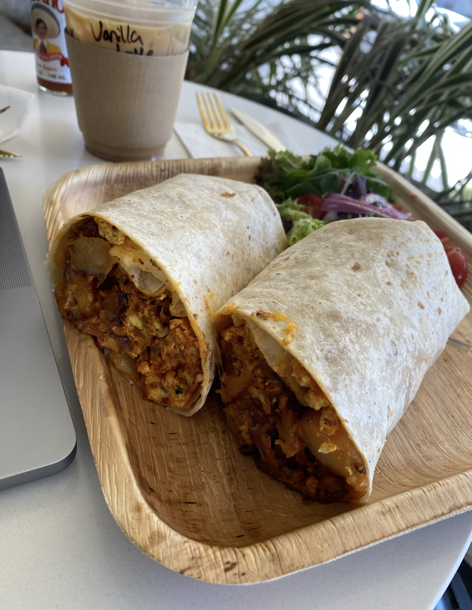

# loveyoulatte
A Redesign website of my favorite coffee shop. 

## The task
To (1) develop a single-page website for your favorite small business in LA and (2) deploy it online. **Please make sure to include a note on your website that it is an unofficial webpage for the small business; if this small business already has a website, please submit your own personal redesign or reimagination of that website instead of duplicating the existing one.**

Time spent: **30** hours spent in total

## Inspiration
I was given an invitation to start this project on Wednesday, April 19th. Initially, I felt lost because I had no idea on what i wanted to create. I thought of making a taqueria or even one of my favorite pizza shops. However, this changed On Saturday April 22 when I visited LoveYouLatte for the very first time. 

My first experience at the LoveYouLatte coffee shop, located in Glendale, left a lasting impression on me. I have been to many coffee shops in the past but I was I was surprised at how unique LoveYouLatte's decor and atmosphere was. The coffee shop's colors and layout gave off a Wes Anderson-esque aesthetic, which immediately caught my attention. Upon entering the coffee shop, a bright purple light that read "bitches who brunch" greeted me, adding to the playful yet welcoming vibe of the place. A pink wall adorned with a series of paintings was located to the left of the shop, but what caught my eye was a beautiful piece featuring the artwork of Frida Kahlo. It felt as though I had stumbled upon a place that truly resonated with my personal experience.

I was inspired to create my own project because of the way that LoveYouLatte made me feel. The welcoming and warm atmosphere made me want to create a similar experience for others, and the unique aesthetic provided me with inspiration for my own project.

**Preview**
<table>
<tr>
<td width="25%">
<center>beam</center>
</td>
<td width="25%">
<center>Art!</center>
</td>
<td width="25%">
<center>Vibes</center>
</td>
<td width="25%">
<center>My Order</center>
</td>
</tr>
<tr>
<td width="25%">
</img>
</td>
<td width="25%">
</img>
</td>
<td width="25%">
</img>
</td>
<td width="25%">
</img>
</td>
</tr>
</table>

## My order: 
- Burrito de Chorizo (10/10)
- Vanilla Latte (10/10)

## Deliverables
A web application that shows information about loveyoulatte and iOS application that uses the love api update products. 

- Web App: http://loveyoulatte.duckdns.org:5000
- ios app: located in this repository 
- Love API: Modifying products
- Tests

## User Stories

The following **required** functionality is completed:

- [x] A section for “About the Business”
- [x] A section with images and descriptions of three (3) to four (4) items/services offered by the business
- [x] At least one HTML button linking to a different website
- [x] A CSS file for styling your website. Use this file to change the color palette and fonts for your website; they cannot be the same as the ones from a template if you choose to use one.
- [x] publish website 

The following **bonus** features are implemented:
- [ ] A photo gallery
- [x] Navigation menu and multiple pages
- [ ] An “overview” section linking to other sections with page anchors
- [x] onHover/onScroll animations
- [x] A mobile responsive site
- [x] More advanced use of flexbox/grid CSS
- [ ] Display if the business is currently open or closed
- [ ] Hide a part of the page until a button is clicked
- [ ] Add something with a JS library you haven’t used before
- [x] dark mode

iOS App Features:
- [x] User can see all products
- [x] User can delete products
- [x] User can Create products
- [x] dark mode


## TOOLS 
- Tmux 
- CentOS for deployment 
- flask 
- python
- linux 
- Javascript
- html/css
- Bash (Scripting)

## Installation

Make sure you have python3 and pip installed

Create and activate virtual environment using virtualenv
```bash
$ python -m venv python3-virtualenv
$ source python3-virtualenv/bin/activate
```

Use the package manager [pip](https://pip.pypa.io/en/stable/) to install all dependencies!

```bash
pip install -r requirements.txt
```

## Usage

Create a .env file using the example.env template (make a copy using the variables inside of the template)

Start flask development server
```bash
$ export FLASK_ENV=development
$ flask run
```

You should get a response like this in the terminal:
```
❯ flask run
 * Environment: development
 * Debug mode: on
 * Running on http://127.0.0.1:5000/ (Press CTRL+C to quit)
```

You'll now be able to access the website at `localhost:5000` or `127.0.0.1:5000` in the browser! 

# Running Unit Tests 
To run unit test created simply run the bash script. 
```bash
    sh runTests.sh
```


# Love API 

# Creating a Product

### Base endpoint 
- BASE URL: http://loveyoulatte.duckdns.org:5000/product/

## Creating a product 

### Endpoint Info
  - endpoint: http://loveyoulatte.duckdns.org:5000/product/create
  - Type: POST

### Body
- [x] image property 
- [x] Price Property 
- [x] name property 

### Response
- 200 OK if product is create 
```bash
     {
       "atype": "matcha",
       "created_at": "Mon, 01 May 2023 21:22:51 GMT",
       "id": 8,
       "imageName": "7e328db3-b443-4f15-a45a-87847bf9ae1a.jpg",
       "image_url": "http://127.0.0.1:5000/api/products",
       "name": "Strawberry Matcha",
       "price": "20.00"
     }
```

- 404 Error if product already exists or if product is missing a property 
```bash
     {
      message: "error type"
     }
```


##  Getting All products

### Endpoint Info
  - endpoint: http://loveyoulatte.duckdns.org:5000/product/
  - Type: GET

### Body
- [x] can be empty 

### Response
- 200 OK if product is create 
```bash
     {
       [
       {
        id: 1
        "image_url": "http://127.0.0.1:5000/api/products",
        price: 20.00
        name: "Hot Chocolate"
        "imageName": "7e328db3-b443-4f15-a45a-87847bf9ae1a.jpg",
       },
       {
        id: 2
        image: "url"
        price: 10.00
        name: "Hot Chocolate 2"
       },
       {
        id: 3
        image: "url"
        price: 50.00
        name: "Hot Chocolate 3"
       },
       {
        id: 4
        image: "url"
        price: 20.00
        name: "Hot Chocolate 4"
       },
         {
        id: 5
        image: "url"
        price: 10.00
        name: "Hot Chocolate 5"
       },

       ]
     }
```

- 404 Error if product already exists or if product is missing a property 
```bash
     {
      message: "error type"
     }
```


##  Deleting  Single Product 

### Endpoint Info
  - endpoint: http://loveyoulatte.duckdns.org:5000/product/{ID}
  - Type: DELTE

### Body
- [x] can be empty 

### Response
- 200 OK if products 
```bash
     {
     }
```

- 404 Error if product already exists or if product is missing a property 
```bash
     {
      message: "error type"
     }
```

\


# iOS App  

The current iOS app creared for this project allows you to modify the existing products. User can also use postman to edit the products. 

## Seeting all Products 


##  Deleting  Single Product 
  - feature: Swipe Left
  


##  Creating products
  - feature: Creating Products 
 


## References 
- https://github.com/MLH-Fellowship/sre-portfolio-site (used just the flask starter code)


